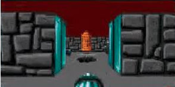

# Cub3D - prémises du jeu vidéo des 90s à la Wolfenstein-3D

explication sur le ray-casting : https://zestedesavoir.com/articles/153/comment-doom-et-wolfenstein-affichaient-leurs-graphismes/.  

Projet Linux,
après avoir cloné le repo, dans le fichier taper la commande "make" puis ./cub3D maps/<la map que vous voulez tester>.   
  

